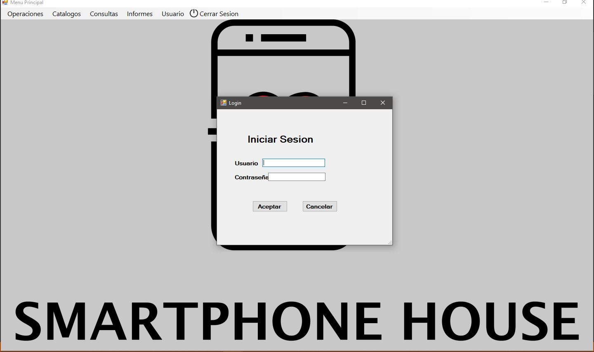
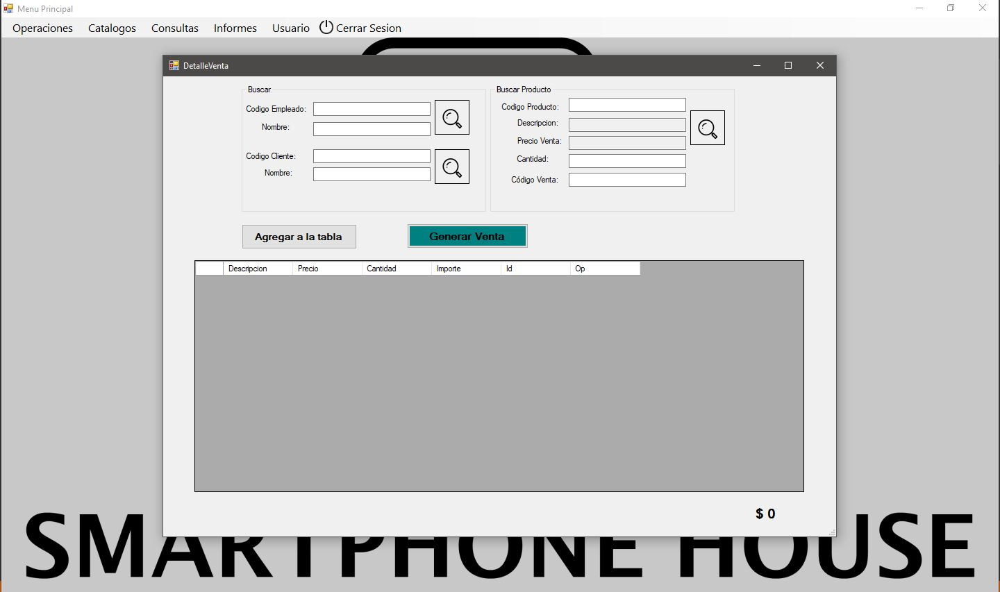
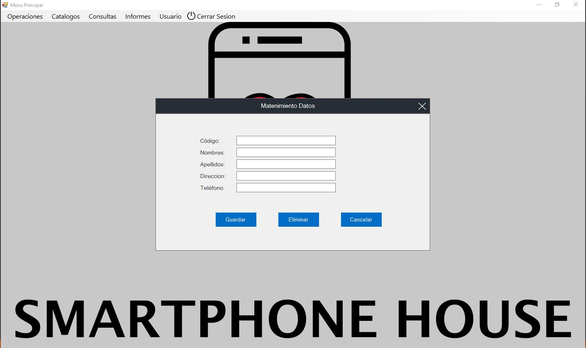

# Sistama de Facturación simple
## Aplicacion de escritorio
### Realizado el primer semestre del 4to año del 2019
#### Realizado con
1. C#
2. Windows forms
3. Entity Framework
4. Arquitectura en capas
5. Programación Orientada a objetos

#### Caracteristicas
1. Reportes
2. Maestro Detalle de compra y venta
3. Login y manejo de roles basico
4. Busquedas 
5. Catalogos

